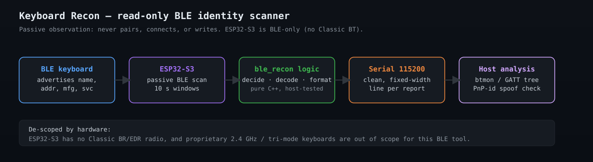

# Keyboard Recon — BLE Identity Scanner

[](https://github.com/savagedamage/keyboard-recon/actions/workflows/ci.yml)
[](LICENSE)

**Find out what a wireless keyboard calls itself before you ever interact with it.**

A keyboard is a computer: an MCU, firmware, a radio, an update path. Hosts trust
its self-declared identity, and identity is cheap to spoof. This is a small,
read-only firmware utility for an ESP32-S3 that passively records what a BLE
keyboard (or any BLE device) advertises when it powers on — so you can answer
*"who is this thing and what radios does it have?"* from evidence, not guesses.

It is the **first-stage reconnaissance** step of a broader peripheral-analysis
workflow. It never pairs, connects, reads GATT, or writes anything; it only
listens to advertisements already on the air.

## How it works



The pipeline is intentionally small and layered so each piece is easy to
understand and to test:

```text
BLE keyboard ──▶ ESP32-S3 (passive BLE scan) ──▶ ble_recon logic (pure C++) ──▶ Serial 115200
                    10 s windows                    decide · decode · format        clean stream
                                                                                        │
                                                                                        └──▶ Host analysis (btmon / GATT / PnP-id spoof check)
```

All the decision and formatting logic lives in [`include/ble_logic.hpp`](include/ble_logic.hpp)
as standard C++ with no hardware dependency, so it runs as an ordinary host unit
test. The sketch in `src/ble_scanner.ino` is just a thin BLE-callback shell that
gathers the advertisement fields and prints what `ble_recon` returns.

## Sample session

This is the exact line format the firmware emits (opened on a serial monitor at
115200, keyboard powered on mid-scan):

```text
=== Keyboard Recon — BLE identity scanner ===
Passive BLE observation: never pairs, connects, or writes.
ESP32-S3 is BLE-only (no Classic BT).
Name filter: none (seeing all devices)
Power on the keyboard and watch its advertised identity stream below.

    3631 ms  RSSI  -59  **NEW**  D6:7E:3A:9B:12:40  [name: XZ-7 Keyboard]  mfg[10]: 02 00 00 00 00 00 00 00 00 00  [Microsoft]  svc: 1812
--- window done: 42 adverts this window, 3 unique this session ---
```

Lines are fixed-width so the live stream stays scannable when several devices
appear at once. Read the [field reference](#reading-the-output) below.

## Project layout

The code is split between the hardware shell and the tested logic so the parts
that matter are verifiable without flashing anything:

```text
include/ble_logic.hpp     pure C++: Company ID decode, name filter, decide, format
src/ble_scanner.ino       ESP32-S3 BLE-callback shell (the sketch you flash)
test/test_ble_logic/      host-native unit tests (Unity)
.github/workflows/ci.yml  builds the firmware + runs the tests in the cloud
docs/architecture.svg     this diagram
platformio.ini            [env:esp32-s3-devkitc-1] (firmware) + [env:native] (tests)
```

## Why this exists

Bluetooth keyboards broadcast their identity in plaintext long before (and often
regardless of) any encryption. That advertisement is a factual, on-the-air record
of:

- the **LE address** the device is using — and whether it keeps changing it;
- the **advertised local name** — which anyone can set;
- **manufacturer-specific data** and the Bluetooth SIG **Company ID** that
  identifies the radio vendor;
- the **service UUIDs** it wants to be known by.

None of that is proof of malice — a cheap consumer board reuses brand VIDs, and a
legitimate one uses a rotating privacy address. But collecting it dispassionately,
on your own hardware, is what lets you tell *"unusual for a keyboard"* from
*"normal"* with a record instead of a hunch. Read-only observation is the safe
first move.

## What it does

| Feature | Behavior |
| --- | --- |
| Discovery | Passive BLE scan, 10 s windows, looping forever so you can power-cycle the keyboard. |
| Identity fields | Address + RSSI, advertised name, manufacturer data (raw hex), service UUIDs. |
| New/changed detection | A device is printed on first sighting (flagged `**NEW**`) and again only if it later *gains* a name, mfg data, or service we had not seen — no flood of repeated lines. |
| Company ID | Decodes a small set of well-known SIG Company IDs; everything else prints as a raw `CID 0xXXXX` to resolve on the SIG list. |
| Optional filter | Set `NAME_FILTER` to only report devices whose advertised name contains a substring. |

## Build and CI

Requires [PlatformIO](https://platformio.org) (or the Arduino IDE with the
Espressif ESP32 core).

```bash
pio run             # compile the firmware for esp32-s3-devkitc-1
pio run -t upload   # flash over USB (USB CDC on boot enabled)
pio device monitor  # serial @ 115200
pio test -e native  # run the host-native logic unit tests (Unity)
```

The firmware build and the unit tests both run in GitHub Actions CI — see the
badge above. The logic is decoupled from the BLE/hardware layer so it runs as an
ordinary host test (no board needed); the ESP32 build is verified in CI because
PlatformIO's tool package mirror was unreachable from the authoring environment.

## Reading the output

```text
    3631 ms  RSSI  -59  **NEW**  D6:7E:3A:9B:12:40  [name: XZ-7 Keyboard]  mfg[10]: 02 00 00 00 00 00 00 00 00 00  [Microsoft]  svc: 1812
```

- **`**NEW**`** — first time this address appeared since power-on/reset.
- **`RSSI`** — signal strength; a stable value means the same physical device.
- **`mfg[...]`** — raw manufacturer payload; the first two bytes are the
  little-endian SIG Company ID. A decoded name (e.g. `[Microsoft]`) means the
  radio vendor is known; `CID 0xXXXX` means resolve it on the assigned-numbers
  list.
- **`svc:`** — advertised GATT service UUIDs. `0x1812` is Human Interface Device
  (HID); any additional UUIDs are worth a second look.
- **The address.** A consumer keyboard is expected to keep a stable public
  address, or a resolvable private address that stays stable once paired (via the
  identity resolving key). A device that mints a **fresh non-resolvable address
  every burst** — or worse, one whose addresses **increment monotonically** — is
  atypical and worth recording as a finding. Capture several windows before
  deciding anything.

## Hardware scope and limits

- **ESP32-S3 is BLE-only.** It has no Classic Bluetooth (BR/EDR) radio, so it
  cannot confirm whether a keyboard *also* talks Classic BT. For that you need a
  BR/EDR-capable controller — an original dual-mode ESP32, or a Classic-capable
  host controller (on Linux `bluetoothctl scan on` lists Classic devices and
  `btmon` captures their HCI).
- **Not every wireless keyboard is Bluetooth.** Many are proprietary 2.4 GHz
  (nRF24 / a vendor "gaming dongle") or tri-mode. This utility sees only BLE;
  handle the others with a 2.4 GHz capture path.
- **Plaintext, not decrypted.** This reads advertisement headers, not encrypted
  key reports. It tells you who the device *claims* to be, not what it types.
- **A name/VID match is not a verdict.** Identity enumeration is evidence for a
  report, not a malware conclusion. See the first-stage/ID-spoof distinction in
  the companion methodology.

## Companion OS-side workflow

The advertised identity is only half the picture. On a Linux host the same device
drives a far richer readout — the GATT tree and PnP ID (0x2A50) versus
Manufacturer Name (0x2A29) to detect identity spoofing, the Report Map (0x2A4B)
to enumerate declared HID capabilities, and an idle-injection test to distinguish
an actual covert keyboard from a normal-looking one. That methodology, its
capture discipline, and its evidence-preservation rules live in the
[`hid-security-research`](https://github.com/savagedamage/hid-security-research)
repo — this firmware feeds it.

## Scope of use

An observation tool for radios and devices in the physical environment. Listen
only to what is already being transmitted, and use the readout to describe and
investigate hardware you can physically account for. Keep the result as recorded
observations plus a clear audit trail — not as a premise for an escalated exploit.

## Contributing

Contributions are welcome! This is a small, focused tool and a genuinely friendly
place to learn BLE and defensive-hardware work without a big commitment. The
things that help most:

- more decoded SIG **Company IDs**, each with a source you can point to;
- a **Classic-BT or 2.4 GHz** capture path or a companion sketch;
- better **host-side integration** (e.g. feeding a `bluetoothctl`/GATT workflow);
- more **edge-case unit tests** for `ble_logic.hpp`.

Open an issue or a pull request — issues are a good way to propose a feature
before writing code. Everything here is public and MIT-licensed.

This is one of the open tools behind [Cormorant Cyber](https://cormorantcyber.com),
an Android/mobile-focused security research and tooling effort (site still in the
works). If you build something similar and want it listed, feel free to link it.

## Related projects

- [HID Security Research](https://github.com/savagedamage/hid-security-research) — the companion defensive HID/keyboard methodology, threat model, and the `keyboard-security-analysis` workflow this firmware feeds.
- [Awesome HID Security](https://github.com/savagedamage/awesome-hid-security) — a curated list of tools, hardware, payloads, and defenses for HID/keyboard security.
- [Android Security Wizard](https://github.com/savagedamage/android-security-wizard) — a mobile-security research corpus (native RE, Shizuku, rooting, malware detection).
- [Pentest Bluestack Toolkit](https://github.com/savagedamage/pentest-bluestack-toolkit) — multi-platform penetration-testing and blue-team tooling.

## License

MIT. See [LICENSE](LICENSE).
